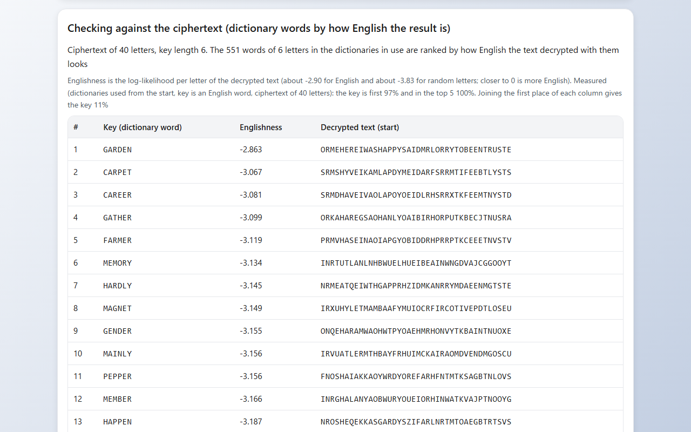
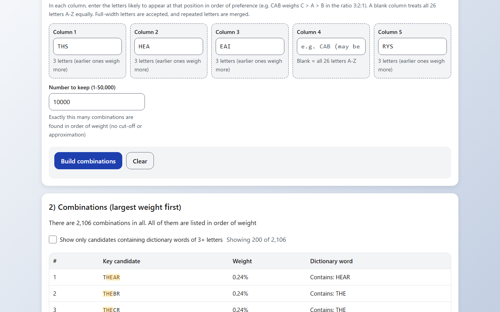
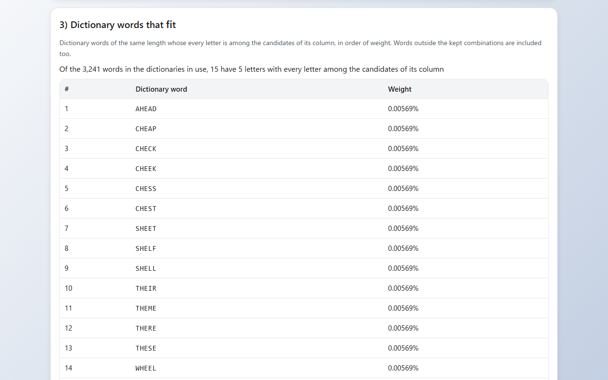
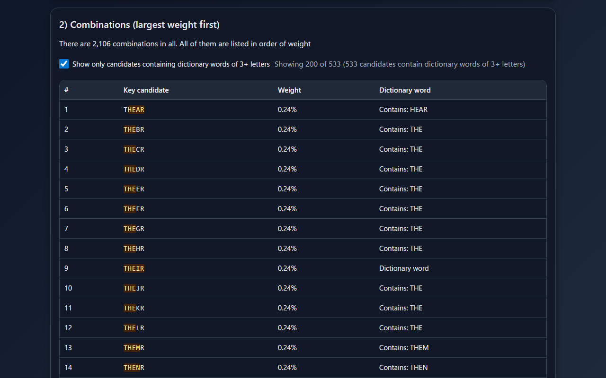

English · [日本語](README.md)

# AlphaLoom - Key Candidate Finder from Column-wise Letters


[](https://ipusiron.github.io/alphaloom/)

**Day046 - 100 Security Tools with Generative AI**

AlphaLoom is a web tool that takes the "likely letters" for each position (column) of a key in order of preference, lists their combinations in order of weight, and checks them against dictionary words to suggest key candidates. Give it a Vigenère ciphertext, and it builds the columns from letter frequencies and ranks dictionary words by how English the text decrypted with each word looks. Its main use is narrowing down a Vigenère key that is an English word. The input and the dictionaries are handled only inside your browser and are never sent anywhere.

---

## 🌐 Demo

👉 **[https://ipusiron.github.io/alphaloom/](https://ipusiron.github.io/alphaloom/)**

You can try it directly in your browser.

---

## 📸 Screenshots

>
>
>*Dictionary words ranked by how English the decrypted text is, for a 40-letter ciphertext with key length 6. Decrypting with GARDEN, the first one, gives English text*

>
>
>*Column candidates (THS, HEA, EAI, blank, RYS) and the combinations in order of weight*

>
>
>*The columns filled from the pattern ?HE?? and the dictionary words that fit them (15 words)*

>
>
>*Only the candidates that contain dictionary words of 3 or more letters, with those words highlighted (dark mode)*

---

## 🪡 About the name

- Alpha: stands for the alphabet, the set of letters that keys and strings are made of
- Loom: a weaving machine, a symbol of the craft of "weaving" keys and patterns from many letters

"Weaver" would also suggest a craftsperson, but "Loom" expresses the relationship "the tool is the loom, the user is the weaver": you make the key candidates with your own hands.

---

## ✨ Features

- Columns from a ciphertext: enter a Vigenère ciphertext and the key length, and for each column the key letters are ranked by how English the decrypted letters look. The top letters (3 by default, 1 to 26) go into the column fields and the combinations are built
- Englishness of dictionary words: the ciphertext is decrypted with every dictionary word as long as the key, and the words are ranked by how English the result is. Measured hit rates for the length of the ciphertext are shown as well
- Key length estimate: up to three key lengths are suggested from the index of coincidence of the columns for each period
- Trial decryption: once a ciphertext is entered, the combinations table and the dictionary words table also show the first 40 letters of the ciphertext decrypted with each key (when the length equals the key length)
- Letters for each column: choose the length (1 to 20) and a field appears for each column. Enter the letters likely to appear at that position in order of preference; earlier letters get larger weights (3:2:1 for CAB). A blank column treats all 26 letters A to Z equally
- Pattern: fill the columns from a pattern such as `?HE??` (a letter fixes that position, ? is a column that can be any letter)
- Combinations with the largest weights: a key's weight is the product of its column weights, and all combinations add up to 100%. The number of combinations to keep (10,000 by default, up to 50,000) is found exactly, from the largest weight down. Even with 26 to the 20th power combinations, every key has exactly the chosen length
- Dictionary words that fit: the words in the dictionaries in use that have the same length and whose letters are all in the candidates of their columns, in order of weight. Words outside the kept combinations are not missed
- Partial matches: show only the candidates that contain dictionary words of 3 or more letters, with those words highlighted
- Dictionaries: choose the built-in mini dictionary and the four bundled dictionaries from a list. Add your own dictionary from a text file or by pasting
- Input: full-width letters and letters with accents are accepted. Fields are not rewritten while an IME is composing
- Export: save the combinations as text, CSV (with a BOM so that Excel opens it correctly) or JSON, and the dictionary words and the ciphertext check as CSV or JSON
- Other tools: links that open the same ciphertext in Vigenère Cipher Tool (Day017) and Modular Text Divider (Day030)
- Screen: Japanese and English, light and dark modes (following the OS setting, with a button to switch), tabs that work with the keyboard, and no horizontal overflow even on a 320 px wide smartphone

---

## 📖 Usage

### Starting from a ciphertext

1. On the "Key candidates" tab, paste a Vigenère ciphertext into "Build the columns from a ciphertext" (anything other than letters is ignored)
2. Enter the key length. If you do not know it, press "Estimate" (up to three lengths are suggested and the first goes into the field)
3. Press "Build the columns". "Checking against the ciphertext" lists the dictionary words by Englishness. At the same time, the top three letters of each column go into the column fields below, and the combinations and the dictionary words that fit are built
4. If the key is an English word, check the top of "Checking against the ciphertext" by whether the decrypted text reads as English. If the key is not in the dictionaries, change the column candidates while looking at the "Decrypted text" in the combinations table

### Entering the column candidates yourself

1. On the "Key candidates" tab, choose the length (5 by default). You can also fill the columns from a pattern (e.g. `?HE??`)
2. In each column, enter the letters likely to appear at that position in order of preference (e.g. `THS` in column 1). Leave a column blank if you have no idea
3. Press "Build combinations". "2) Combinations" lists the key candidates in order of weight and "3) Dictionary words that fit" lists the dictionary words that fit the columns
4. If the key is likely to be an English word, look at "Dictionary words that fit" first

On the "Dictionaries" tab you can choose the dictionaries to use and add your own word lists. Results can be exported with "Save as text", "Save as CSV" and "Save as JSON". When opened from the public version (HTTPS), the two general English bundled dictionaries (english_5067 and english_1842) are loaded from the start.

---

## 🔗 Passing a ciphertext in the URL

Add `?text=` (the ciphertext) and `&n=` (the key length) to the URL to open the tool with the columns already built from that ciphertext. Without `&n=`, the key length is estimated and entered in the field. The format is the same as Modular Text Divider (Day030), so other tools and articles can open the tool with a ciphertext.

- `https://ipusiron.github.io/alphaloom/?text=URDHLRXEZZEFNAGSCFGIUPVYURIBXBHEVQXEASKH&n=6`
- `?text=` takes up to 10,000 letters and `&n=` takes 1 to 20
- The language can be chosen with `?lang=ja` or `?lang=en`

---

## 🔬 How the weights and the search work

The candidate letters of each column get linear weights, larger at the front. With N letters, the ratio is N, N−1, …, 1 from the front, divided so that the total is 1 (for CAB, C = 1/2, A = 1/3, B = 1/6). In a blank column every one of the 26 letters gets 1/26. A key's weight is the product of its column weights, and the weights of all combinations add up to 100%. This value follows from how the column candidates were given; it is not the probability that the key is correct.

- Combinations: the candidates of each column are sorted by weight, so the tuples of "which letter of each column to use" are taken from a priority queue, largest weight first. For each tuple taken, the tuples that advance one column by one letter are added to the queue. The top combinations are found exactly without trying them all (the tests check that they match a brute-force ranking)
- Dictionary words that fit: for each dictionary word of the same length, the weights of its letters at each position are multiplied. Words with a letter that is not among the candidates of its column are dropped

With the dictionaries used from the start (built-in + english_5067 + english_1842, 3,241 words), the results are as follows.

| Column candidates | Combinations | Dictionary words that fit |
|---|---|---|
| THS, HEA, EAI, blank, RYS | 2,106 | THEIR 0.24%, HEAVY 0.0475% |
| ?HE?? (pattern) | 17,576 | AHEAD, CHEAP, CHECK, CHEEK, CHESS, CHEST, SHEET, SHELF, SHELL, THEIR, THEME, THERE, THESE, WHEEL, WHERE |

- In the first example, THESE cannot be made (the fifth column's candidates R, Y and S have no E)
- In the second example, the blank columns all have equal weights, so the 15 words have the same weight (0.00569%) and are in ABC order

See [ALGORITHM.md](ALGORITHM.md) (in Japanese) for the details and the running time.

---

## 🔐 Finding a key from a ciphertext

In the Vigenère cipher with key length L, each column made by splitting the ciphertext every L letters is a single Caesar cipher (the same shift). AlphaLoom decrypts each column with all 26 shifts, computes how English the result is (the log-likelihood per letter) from the frequencies of letters in English, and ranks the key letters by it. The English letter frequencies are counted from the text of Pride and Prejudice (Project Gutenberg).

Joining the first letter of each column looks like it should give the key, but with a short ciphertext each column has few letters and the first places rarely all match. So the whole ciphertext is decrypted with each dictionary word as long as the key, and the words are ranked by how English the decrypted text is. The Englishness is about -2.90 for English text and about -3.83 for random letters; closer to 0 is more English.

As an example, take the following ciphertext: a passage from A Tale of Two Cities (40 letters, letters only) encrypted with the key GARDEN.

```
URDHLRXEZZEFNAGSCFGIUPVYURIBXBHEVQXEASKH
```

Set the key length to 6 and press "Build the columns". With the dictionaries used from the start, the 551 six-letter words are ranked as follows.

| Rank | Key (dictionary word) | Englishness | Decrypted text |
|---|---|---|---|
| 1 | GARDEN | -2.863 | ORMEHEREIWASHAPPYSAIDMRLORRYTOBEENTRUSTE |
| 2 | CARPET | -3.067 | SRMSHYVEIKAMLAPDYMEIDARFSRRMTIFEEBTLYSTS |
| 3 | CAREER | -3.081 | SRMDHAVEIVAOLAPOYOEIDLRHSRRXTKFEEMTNYSTD |

- Joining the first letter of each column gives UAROEN, which matches only 4 of the 6 letters (the G of column 1 and the D of column 4 are second)
- With the top three letters of each column in the column fields, there are 729 combinations and GARDEN is the 9th. GARDEN is the only word left in "Dictionary words that fit" (0.694%)
- Pressing "Estimate" on these 40 letters suggests key lengths 4, 12 and 20, which do not include the correct 6. For 300 letters of English encrypted with the key LEMON, the first estimate is 5

The hit rates for keys that are English words were measured for each length of ciphertext. The keys are words of 4 to 8 letters from english_5067 and english_1842, the plaintexts are excerpts from A Tale of Two Cities, and each length was tried 1,500 times (300 times for each key length from 4 to 8). The correct key length was given.

| Ciphertext letters | Key from the first letter of each column | Key first in the dictionary | Key in the dictionary top 5 | First with the large dictionary | Top 5 with the large dictionary |
|---|---|---|---|---|---|
| 24 | 2% | 81% | 98% | 52% | 81% |
| 40 | 11% | 97% | 100% | 84% | 99% |
| 60 | 31% | 99% | 100% | 95% | 100% |
| 100 | 66% | 100% | 100% | 100% | 100% |
| 160 | 93% | 100% | 100% | 100% | 100% |

- "The dictionary" means the dictionaries used from the start (3,241 words); "with the large dictionary" means with 12dicts added (64,696 words)
- Adding the large dictionary brings in more similar words, so the key is first less often (the six-letter words grow from 551 to 7,355). Add it when the key is not in the first dictionaries
- Percentages are rounded (1,499 out of 1,500 is also shown as 100%)
- On the screen, the row for the longest measured length not exceeding the ciphertext is shown above the results
- The measurement can be reproduced with `node tools/measure-accuracy.mjs` (it uses a random generator with a fixed seed)

---

## 📚 Dictionaries

Text files in `wordlists/` (one word per line). The word counts are after converting to letters only and removing duplicates.

| File | Contents | Lines | Words | Used from the start |
|---|---|---|---|---|
| english_5067.txt | General English words | 5,068 | 2,945 | ○ |
| english_1842.txt | Basic English words (most frequent first) | 1,842 | 1,472 | ○ |
| animals.txt | Animal names | 695 | 546 | |
| english-mini-223.txt | The words of the built-in mini dictionary | 223 | 222 | ○ (built-in) |
| 12dicts-3of6game.txt | Large English dictionary (12dicts, with inflected forms) | 64,662 | 64,662 | |

- The built-in mini dictionary (222 words) has common English words and words from cryptography and computing, and needs no loading. english-mini-223.txt has the same words one per line (223 lines, because ABOUT appears twice) and serves as a sample for making your own dictionary
- The large English dictionary is loaded only when you choose it on the "Dictionaries" tab (about 600 KB)
- Add your own dictionary as a text file with one word per line (UTF-8, up to 10 MB and 500,000 words) or by pasting. Lower case and symbols are converted to letters only

When making your own dictionary on Linux or macOS, tidying it up as follows makes it easier to handle (convert to upper case, keep lines with letters only, sort and remove duplicates).

```bash
tr '[:lower:]' '[:upper:]' < input.txt | grep '^[A-Z]\+$' | sort -u > words.txt
```

---

## 🎯 Use cases

- Learning the Vigenère cipher: enter a ciphertext and compare the per-column frequency analysis with the text decrypted with dictionary words. You can see that even with a short ciphertext whose column first places do not match, a key that is an English word comes near the top of the dictionary words. Check how the cipher works in [Vigenère Cipher Tool (Day017)](https://ipusiron.github.io/vigenere-cipher-tool/) and how the text is split into columns in [Modular Text Divider (Day030)](https://ipusiron.github.io/modular-text-divider/)
- Classical crypto problems in CTFs: once the key length is known, narrow down the English words that could be the key. If part of the key is known (e.g. the 2nd and 3rd letters are HE), fill the columns from a pattern and list the English words that fit
- Crosswords and puzzles: find words with known letters at known positions (15 words for ?HE??). Where a position is narrowed to several letters, put those letters in the column
- Teaching cryptography: change the length of the ciphertext and show the difference between how often the first places of the columns match and how often dictionary words find the key, with the measured table and examples at hand
- Teaching probability and combinations: check with real numbers that the product of the numbers of candidates per column is the total number of combinations, and that the products of the weights add up to 100% over all combinations
- Teaching algorithms: try the method of taking the top combinations without trying them all (a priority queue), even on inputs with 26 to the 20th power combinations
- Learning English vocabulary: find and learn words that fit conditions on the positions of letters
- With your own glossary: paste technical terms or the names in a work as a dictionary and check against them. The dictionary is never sent outside the browser

---

## 🔒 Security and privacy

- The ciphertext, the letters and the dictionaries you load are handled only inside the browser. Nothing is sent to or stored on a server (dictionaries disappear when the page is closed)
- The links to other tools put the ciphertext into the URL only when clicked, and open it in a new tab (`rel="noopener noreferrer"`)
- A Content Security Policy (meta) limits scripts, styles and connections to the same site. No inline scripts, inline event handlers or style attributes are used
- Dictionary names (file names) and key candidates are always put on the screen with `textContent` (never interpreted as HTML)
- Bundled dictionaries are read only from the files in the list. No arbitrary URL is read
- Files up to 10 MB and 500,000 words, and ciphertexts up to 10,000 letters
- Only the theme and language choices are saved in localStorage

---

## ⚠️ Notes and limitations

- A weight follows from how the column candidates are ordered; it is not the probability that the key is correct. If the column candidates are off, the correct key gets a small weight
- Building the columns from a ciphertext works only for the Vigenère cipher (shifting with A = 0, letters only). It does not work for other polyalphabetic ciphers or autokey ciphers
- The Englishness assumes English text and means little if the plaintext is not English
- The key length estimate often misses with short ciphertexts (in the 40-letter example above, the correct 6 is not among the suggestions). If it seems wrong, try a few key lengths
- The Englishness of dictionary words finds only keys that are words in the dictionaries. For keys that are not English words, use the column candidates and the combinations table (decrypted text)
- With many blank columns, a large number of combinations have the same weight and are listed in ABC order. The screen says so; enter candidates in the columns or use the dictionary words that fit
- Only letters A to Z are handled
- With 50,000 combinations to keep and a length of 20, the calculation takes a few seconds ("Working…" is shown meanwhile)
- If the page is opened directly as a file (file://), the tool does not start in Chrome or Edge (they cannot load ES modules from files). It starts in Firefox, but the bundled dictionaries cannot be loaded (the built-in mini dictionary works). Open it over HTTP as described under "Requirements" below

---

## 🧪 Tests

The logic (`js/loom-core.js`, `js/vigenere.js` and others) is kept in modules that do not depend on the DOM and is tested with the standard Node.js test runner (`node:test`). There are no dependencies.

```bash
npm test
```

- Node.js 22 or later
- Runs automatically in GitHub Actions on every push and pull request
- Checks that the top combinations match the top of a brute-force ranking (300 random inputs), that keys keep their length even at 20 letters, and the word counts of the bundled dictionaries
- Checks a known answer of the cipher (ATTACKATDAWN with key LEMON gives LXFOPVEFRNHR), the ranking in the ciphertext example, and that the measured table matches a fresh run of the measuring tool
- Also checks the tables and numbers in the Japanese and English READMEs, the CSP, labels and tab roles in index.html, color contrast (at least 4.5:1 in both light and dark modes) and the keys of the Japanese and English strings

---

## 📁 Directory structure

```
alphaloom/
├── .github/                  # GitHub settings
│   └── workflows/            # GitHub Actions workflows
│       └── test.yml          # Runs npm test on push and pull requests
├── assets/                   # Images
│   ├── en/                   # Screenshots for the English README
│   │   ├── screenshot.png    # Checking against the ciphertext
│   │   ├── screenshot2.png   # Column candidates and combinations
│   │   ├── screenshot3.png   # Dictionary words that fit
│   │   └── screenshot4.png   # Partial matches, dark
│   ├── favicon.svg           # Favicon
│   ├── screenshot.png        # Screenshot for the Japanese README (ciphertext)
│   ├── screenshot2.png       # Screenshot for the Japanese README (combinations)
│   ├── screenshot3.png       # Screenshot for the Japanese README (dictionary words)
│   └── screenshot4.png       # Screenshot for the Japanese README (partial, dark)
├── js/                       # Modules other than the screen
│   ├── accuracy.js           # Key hit rates by ciphertext length (measured, generated)
│   ├── english.js            # English letter counts (generated)
│   ├── file-check.js         # Notice when the tool cannot start from file://
│   ├── i18n.js               # Choosing and switching the language (Japanese, English)
│   ├── loom-core.js          # Search logic (weights, top combinations, dictionary scoring, partial matches, CSV)
│   ├── messages.js           # Strings shown on the screen (Japanese, English)
│   ├── params.js             # Reads the ciphertext and key length from ?text= and ?n=
│   ├── tabs.js               # Tab switching (including the keyboard)
│   ├── theme-init.js         # Applies the theme at the start of loading
│   ├── theme.js              # Light/dark switching
│   ├── vigenere.js           # Ciphertext analysis (key length, column candidates, Englishness of words, decryption)
│   └── wordlists.js          # Built-in mini dictionary and the list of bundled dictionaries
├── test/                     # Tests (node:test)
│   ├── contrast.test.js      # Color contrast, sizes of fields and controls
│   ├── core.test.js          # Normalization, patterns, weights, top combinations, dictionary scoring, CSV
│   ├── format.test.js        # Line length, control characters, minimum line counts
│   ├── html.test.js          # CSP, element ids, tab roles, labels
│   ├── i18n.test.js          # Keys of both languages, no Japanese in English, initial language
│   ├── messages.test.js      # Where strings live and their keys
│   ├── params.test.js        # Reading ?text= and ?n=
│   ├── readme.test.js        # Tables, structure, tree and images of both READMEs
│   ├── vigenere.test.js      # Ciphertext analysis, known answers, the hit-rate table
│   └── wordlists.test.js     # Bundled dictionary counts and the built-in mini dictionary
├── tools/                    # Generating and measuring tools (Node.js)
│   ├── corpus/               # English excerpts (letters only, Project Gutenberg)
│   │   ├── eval-pg98.txt     # For evaluation: A Tale of Two Cities (#98)
│   │   └── train-pg1342.txt  # For letter frequencies: Pride and Prejudice (#1342)
│   ├── build-english.mjs     # Counts English letters and writes js/english.js
│   └── measure-accuracy.mjs  # Measures key hit rates and writes js/accuracy.js
├── wordlists/                # Bundled dictionaries (one word per line)
│   ├── 12dicts-3of6game.txt  # Large English dictionary (12dicts 3of6game, public domain)
│   ├── 12dicts-NOTICE.md     # Source, license and SHA-256 of 12dicts
│   ├── animals.txt           # Animal names
│   ├── english-mini-223.txt  # The words of the built-in mini dictionary
│   ├── english_1842.txt      # Basic English words
│   └── english_5067.txt      # General English words
├── .gitignore                # Git ignore settings
├── .nojekyll                 # Tells GitHub Pages not to use Jekyll
├── ALGORITHM.md              # How the weights, the search and the ciphertext analysis work (Japanese)
├── CLAUDE.md                 # Development notes for Claude Code
├── LICENSE                   # License (MIT)
├── README.en.md              # This document
├── README.md                 # Japanese document
├── index.html                # Screen
├── package.json              # npm test settings (no dependencies)
├── script.js                 # Screen logic (ES module)
└── style.css                 # Styles (light and dark)
```

---

## 💻 Requirements

- Tested with the latest Chrome, Edge and Firefox (Safari has not been tested)
- The public version ([https://ipusiron.github.io/alphaloom/](https://ipusiron.github.io/alphaloom/)) can be used as it is
- To run it locally, run `python -m http.server 8000` or similar in the folder and open `http://localhost:8000/`

---

## 📄 License

- See the `LICENSE` file for the license of the source code.
- The large English dictionary (`wordlists/12dicts-3of6game.txt`) is a list from Alan Beale's 12dicts, which the author explicitly released to the public domain. See [wordlists/12dicts-NOTICE.md](wordlists/12dicts-NOTICE.md) for the source.
- The English text in `tools/corpus/` is excerpts of Project Gutenberg eBooks (#98 and #1342, public domain in the United States) with only the letters kept.

---

## 🛠️ About this tool

This tool was developed as part of the "100 Security Tools with Generative AI" project.
The project creates and publishes a wide variety of security-related tools over 100 days with the help of AI.

For details about the project and other tools, see the following page.

🔗 [https://akademeia.info/?page_id=42163](https://akademeia.info/?page_id=42163)
