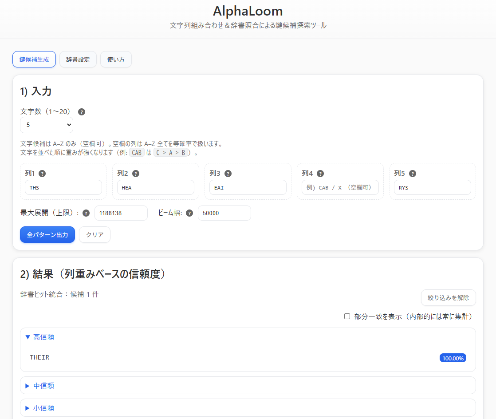

<!--
---
title: AlphaLoom
category: classic-crypto
difficulty: 2
description: Alphabet-combination tool that generates key candidates and ranks them with dictionary hits.
tags: [vigenere, cryptography, keysearch, dictionary, combinator]
demo: https://ipusiron.github.io/alphaloom/
---
-->

# AlphaLoom - 文字組み合わせ＆生成文字列分析ツール


[](https://ipusiron.github.io/alphaloom/)

**Day046 - 生成AIで作るセキュリティツール100**

---

## 📜 概要

**AlphaLoom** は、列ごとの候補文字とその重みから、可能なすべての文字列パターン（鍵候補）を生成し、  信頼度順に分類・表示できるWebツールです。  

さらに、読み込んだ辞書を用いて部分一致／完全一致の照合を行い、辞書ヒットも加味した統合信頼度で候補を再ランキングできます。

ヴィジュネル暗号の終盤の鍵キーワード特定を主な用途としていますが、他の暗号や文字列解析にも応用可能な汎用設計になっています。

---

## 🪡 ツール名と由来

- **Alpha** = Alphabet（アルファベット）を指し、鍵や文字列の素材である文字群を意味します。  
- **Loom** = 織機を意味し、複数の文字を組み合わせて鍵やパターンを「織り成す」職人的プロセスを象徴します。

「Weaver」自体にも職人の意味がありますが、「Loom」にすることで「ツール＝織機」「ユーザー＝織り手」という関係性を表現し、利用者が自らの手で鍵候補を作り出すイメージを込めています。

---

## 🌐 デモページ

👉 **[https://ipusiron.github.io/alphaloom/](https://ipusiron.github.io/alphaloom/)**

ブラウザーで直接お試しいただけます。

---

## 📸 スクリーンショット

>   
>
> *ヴィジュネル暗号解読シナリオ例*

---

## ✨ 主な機能

### 🔧 基本機能
1. **鍵長プルダウン指定（1〜20文字）**
   - 生成する鍵候補の文字数を選択
   - 各文字数に応じた最適化されたパラメーター推奨値を表示

2. **列ごとの候補文字入力**
   - 空欄は全A–Z文字を等確率で処理
   - 入力順序による重み付け（先頭文字ほど高い確率）
   - リアルタイム文字検証（A–Z以外は自動除去）
   - 重複文字の自動除去とヘルプツールチップ

3. **高性能ビームサーチによる全パターン生成**
   - 設定可能なビーム幅と最大展開数
   - パラメーター妥当性チェックと推奨値提案
   - 信頼度計算による候補の自動ランキング
   - 結果を高／中／小信頼度の3グループに自動分類

### 🔍 辞書機能
4. **高度な辞書による絞り込み**
   - 完全一致・部分一致の切替表示（内部的には両方常時計算）
   - 統合信頼度スコア（列重み60% ＋ 辞書ヒット40%）による再ランキング
   - 部分一致時の安全なハイライト表示（XSS対策済み）

5. **柔軟な複数辞書管理**
   - 内蔵ミニ辞書（厳選200語）
   - ローカルファイル読み込み（.txt形式）
   - 相対パスでのfetch取得（GitHub Pages対応）
   - 辞書ごとの有効化・無効化切替
   - 自動文字正規化（大文字変換・重複除去）

### 📤 エクスポート・セキュリティ
6. **安全な結果エクスポート**
   - 1行1キーワードのプレーンテキスト形式
   - 日時付きファイル名での自動保存
   - ビーム幅上限到達時の警告表示
   - セキュリティ強化（ファイル名サニタイズ・CSP対応）

### 🎛️ 詳細設定・UI
7. **直感的なユーザーインターフェイス**
   - タブ形式の機能分離（生成・辞書・使い方）
   - ヘルプアイコン付きパラメーター説明
   - レスポンシブデザイン（モバイル対応）
   - ライトモード採用で視認性向上

8. **高度なパラメーター制御**
   - ビーム幅：多様性と精度のバランス調整
   - 最大展開数：処理速度と完全性のトレードオフ
   - 文字数に応じた推奨値の自動計算・提案
   - 設定不備時の確認ダイアログ表示

---

## 🎯 ターゲット層

AlphaLoomは以下のユーザーを対象としています：

### 🔐 暗号解読者・研究者
- **クリプト・アナリスト**: ヴィジュネル暗号やポリアルファベット暗号の解読
- **セキュリティ研究者**: 古典暗号の解析手法研究
- **暗号学習者**: 実践的な暗号解読スキルの習得

### 🚩 CTF参加者・競技者
- **CTF選手**: Crypto問題での効率的な鍵探索
- **チーム戦略家**: 複数候補の並列検証によるタイムアタック
- **解法研究者**: 新しいアプローチの実験・検証

### 🎓 教育・学習分野
- **情報セキュリティ教育者**: 暗号解読の実演・教材作成
- **学生・研究生**: 暗号理論の実践的理解
- **技術愛好家**: 暗号技術への理解深化

---

## 💡 活用シナリオ

### 📜 ヴィジュネル暗号解読シナリオ

**状況**: 5文字のヴィジュネル暗号を解読中、頻度解析である程度の手がかりを得た

```
暗号文: LXFOPVEFRNHRXKVPQXMQKHTQWQYUXJVWKQBZ
推定鍵長: 5文字
頻度解析結果:
  位置1: T, H, S (出現頻度順)
  位置2: H, E, A  
  位置3: E, A, I
  位置4: (不明、全文字候補)
  位置5: R, Y, S
```

**AlphaLoom活用手順**:
1. **鍵長5を選択**し、各列に頻度解析結果を入力
   - 列1: `THS`, 列2: `HEA`, 列3: `EAI`, 列4: (空欄), 列5: `RYS`
2. **辞書絞り込み**で英単語らしい候補に絞る
3. **部分一致表示**で`THE`, `KEY`などの部分文字列をハイライト
4. **上位候補を試行**: `THEIR`, `THESE`, `HEARY` など

**期待される効果**: 手動では数時間かかる作業を数分で完了、見落としがちな候補も発見

### 🚩 CTF活用シナリオ1: タイムアタック戦略

**競技状況**: Crypto問題で時間制限あり、複数チームが同時進行

**問題**: ヴィジュネル暗号 + ヒント「鍵は英単語」

**AlphaLoom戦略**:
1. **並列作業**: チームメンバーがそれぞれ異なる鍵長で同時検索
2. **辞書最適化**: 問題文脈から推測される単語カテゴリーの辞書を追加
3. **結果共有**: エクスポート機能で候補リストを即座にチーム共有
4. **段階的絞り込み**: 大まかな候補→辞書絞り込み→手動検証の効率的フロー

**勝利要因**: 他チームが1つずつ手動試行する間に、網羅的候補生成で先手を取る

### 🚩 CTF活用シナリオ2: 複合暗号攻略

**競技状況**: 複数段階の暗号が組み合わさった高難易度問題

**問題構成**: Base64 → ヴィジュネル → ROT13 の多段暗号

**AlphaLoom活用ポイント**:
1. **中間結果の再利用**: 第2段階で部分的に得られた情報を列重みに反映
2. **仮説検証**: 複数の鍵候補を並行してROT13段階で検証
3. **パターン認識**: 辞書ヒットした候補の共通パターンを発見
4. **効率的総当り**: ビーム幅調整で計算時間とカバー率のバランス最適化

**成功例**: 
- 第2段階で`?HE??`パターンを発見
- AlphaLoomで`SHEET`, `THEME`, `WHEEL`などを候補生成
- 最終段階で`THEME`が正解と判明、総所要時間15分

---

## 🧮 アルゴリズム詳細

本ツールで使用されているアルゴリズムの詳細については、以下をご覧ください：

👉 **[ALGORITHM.md - アルゴリズム解説](ALGORITHM.md)**

- ビームサーチによる候補生成
- 線形重み付け信頼度計算  
- 辞書統合スコアリング
- パフォーマンス最適化手法
- 実用的な使用例と設定指針

---

## 📁 ディレクトリ構造

```
alphaloom/
├── index.html               # メインのWebアプリケーションファイル
├── script.js                # JavaScript実装（ビームサーチ・辞書機能）
├── style.css                # スタイルシート（ライトモード・レスポンシブ）
├── README.md                # プロジェクト概要・使用方法
├── ALGORITHM.md             # アルゴリズム詳細解説
├── CLAUDE.md                # Claude Code用プロジェクト情報
├── LICENSE                  # MITライセンス
├── .gitignore               # Git除外設定
├── .nojekyll                # GitHub Pages用設定
├── assets/                  # 静的アセット（現在は空）
│   └── screenshot.png       # スクリーンショット（予定）
└── wordlists/               # 辞書ファイル群
    ├── english-mini-223.txt # 厳選英単語辞書（223語）
    ├── english_1842.txt     # 中規模英単語辞書（1,842語）
    ├── english_5067.txt     # 大規模英単語辞書（5,067語）
    └── animals.txt          # 動物名辞書（専門用途）
```

### 📂 ファイル説明

#### 🌐 Webアプリケーション
- **index.html**: UI構造・タブ機能・セキュリティヘッダー（CSP）
- **script.js**: ビームサーチアルゴリズム・辞書統合・エクスポート機能
- **style.css**: ライトモード・レスポンシブデザイン・ヘルプアイコン

#### 📖 ドキュメント
- **README.md**: 機能概要・使用方法・活用シナリオ
- **ALGORITHM.md**: 技術詳細・パフォーマンス分析・理論背景
- **CLAUDE.md**: AI支援開発用プロジェクト情報

#### 📚 辞書リソース
- **english-mini-223.txt**: 内蔵辞書・高頻度英単語
- **english_1842.txt**: 一般的な英単語・CTF用途
- **english_5067.txt**: 包括的英単語・研究用途
- **animals.txt**: 特定カテゴリー・テーマ別解読

---

## 📚 辞書ファイル仕様

### 必須要件
- **形式**: 1行1ワード
- **文字**: すべて大文字（A-Z）のみ
- **エンコーディング**: UTF-8

### 推奨事項（処理効率向上）
- **ソート済み**: アルファベット順
- **重複除去済み**: 同一単語の削除

### 辞書ファイル最適化用Linuxコマンド

```bash
# 基本的な最適化（大文字化・ソート・重複除去）
cat input.txt | tr '[:lower:]' '[:upper:]' | grep '^[A-Z]*$' | sort -u > optimized.txt

# より詳細な最適化
cat input.txt \
  | tr '[:lower:]' '[:upper:]' \
  | grep '^[A-Z]\+$' \
  | sort -u \
  | awk 'length($0) >= 2' > optimized.txt

# 統計情報付き
echo "元のファイル: $(wc -l < input.txt) 行"
cat input.txt | tr '[:lower:]' '[:upper:]' | grep '^[A-Z]*$' | sort -u > optimized.txt
echo "最適化後: $(wc -l < optimized.txt) 行"
```

**コマンド説明**:
- `tr '[:lower:]' '[:upper:]'`: 小文字を大文字に変換
- `grep '^[A-Z]*$'`: A-Z のみの行を抽出
- `sort -u`: ソートと重複除去を同時実行
- `awk 'length($0) >= 2'`: 2文字以上の単語のみ抽出（オプション）

---

## 📄 ライセンス

MIT License - 詳細は [LICENSE](LICENSE) をご覧ください。

---

## 🛠 このツールについて

本ツールは、「生成AIで作るセキュリティツール100」プロジェクトの一環として開発されました。  
このプロジェクトでは、AIの支援を活用しながら、セキュリティに関連するさまざまなツールを  
100日間にわたり制作・公開していく取り組みを行っています。

プロジェクトの詳細や他のツールについては、以下のページをご覧ください。

🔗 [https://akademeia.info/?page_id=42163](https://akademeia.info/?page_id=42163)

