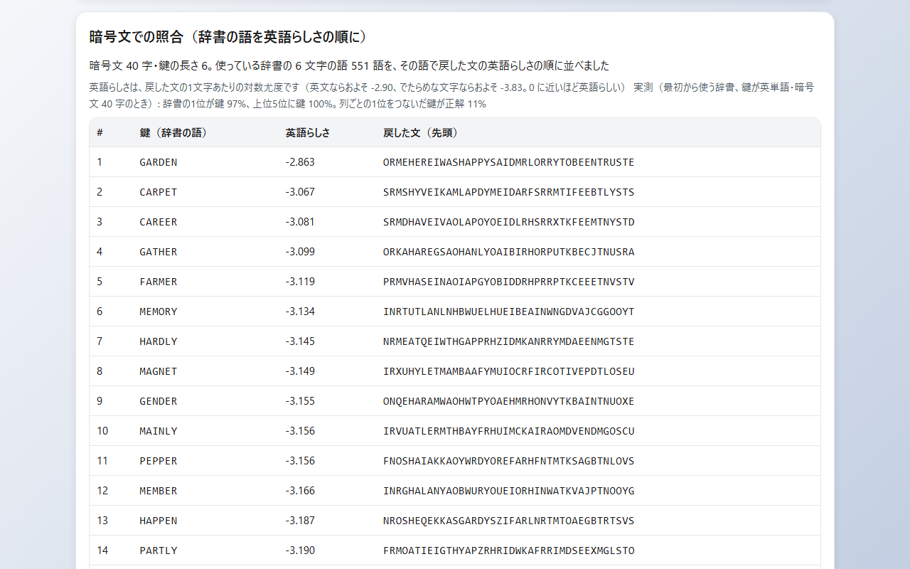
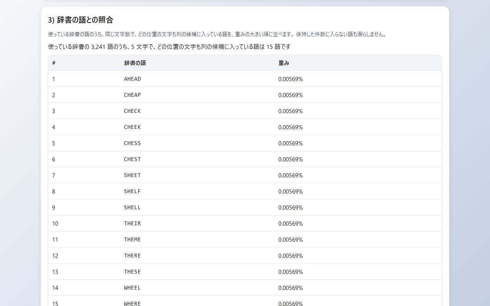
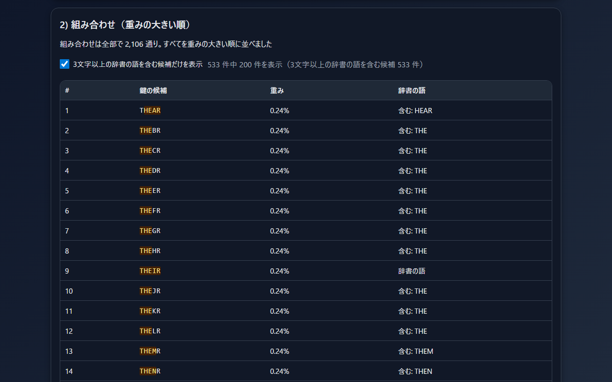

<!--
---
id: day046
slug: alphaloom

title: "AlphaLoom"

subtitle_ja: "列ごとの候補文字から鍵を探すツール"
subtitle_en: "Key Candidate Finder from Column-wise Letters"

description_ja: "鍵の位置（列）ごとに来そうな文字を優先順に並べると、重みの大きい組み合わせを正確に並べ、辞書の語を列の候補で採点して鍵の候補を示す。ヴィジュネル暗号の鍵（英単語）の特定や、文字の位置がわかっている語の探索に使う"
description_en: "Arrange the likely letters for each position (column) of a key in order of preference, and the tool lists the combinations with the largest weights exactly and scores dictionary words against the columns. Useful for identifying Vigenère keys that are English words and for finding words with known letter positions"

category_ja:
  - 古典暗号
  - 暗号解読
category_en:
  - Classic Cryptography
  - Cryptanalysis

difficulty: 1

tags:
  - vigenere
  - cryptography
  - keysearch
  - dictionary
  - classical-cipher
  - ctf

repo_url: "https://github.com/ipusiron/alphaloom"
demo_url: "https://ipusiron.github.io/alphaloom/"

hub: true
---
-->

# AlphaLoom - 列ごとの候補文字から鍵を探すツール


[](https://ipusiron.github.io/alphaloom/)

**Day046 - 生成AIで作るセキュリティツール100**

AlphaLoomは、鍵の位置（列）ごとに「来そうな文字」を優先順に並べると、その組み合わせを重みの大きい順に並べ、辞書の語と照らして鍵の候補を示すWebツールです。主な用途は、ヴィジュネル暗号で鍵の長さと列ごとの手がかりが得られたあとに、鍵の英単語を絞り込むことです。入力も辞書もブラウザーの中だけで扱い、外部へは送りません。

---

## 🌐 デモページ

👉 **[https://ipusiron.github.io/alphaloom/](https://ipusiron.github.io/alphaloom/)**

ブラウザーで直接お試しいただけます。

---

## 📸 スクリーンショット

>
>
>*列の候補（THS・HEA・EAI・空欄・RYS）と、重みの大きい順の組み合わせ*

>
>
>*パターン?HE??から列を埋め、列の候補に合う辞書の語を並べたところ（15語）*

>
>
>*3文字以上の辞書の語を含む候補だけを表示し、含む語をハイライト（ダークモード）*

---

## 🪡 ツール名と由来

- Alpha: Alphabet（アルファベット）を指し、鍵や文字列の素材である文字群を意味する
- Loom: 織機を意味し、複数の文字を組み合わせて鍵やパターンを「織り成す」職人的なプロセスを象徴する

「Weaver」自体にも職人の意味がありますが、「Loom」にすることで「ツール＝織機」「ユーザー＝織り手」という関係性を表現し、利用者が自らの手で鍵候補を作り出すイメージを込めています。

---

## ✨ 主な機能

- 列ごとの候補文字: 文字数（1〜20）を選ぶと列の欄が並ぶ。各列に来そうな文字を優先順に入れると、先頭ほど重い重みが付く（CABなら3:2:1）。空欄の列はA〜Zの26文字を同じ重みで扱う
- パターン: `?HE??`のような形から列を埋める（英字はその位置の文字、?はどの文字でもよい列）
- 重みの大きい組み合わせ: 鍵の重みは各列の重みの積で、すべての組み合わせの合計が100%になる。重みの大きいものから、保持する件数（既定1万件、上限5万件）を正確に求める。組み合わせが26の20乗通りあっても、鍵はかならず指定の文字数になる
- 辞書の語との照合: 使っている辞書の語のうち、同じ文字数で、どの位置の文字も列の候補に入っている語を、重みの大きい順に並べる。保持した件数に入らない語も漏らさない
- 部分一致: 3文字以上の辞書の語を含む候補だけを表示し、含む語をハイライトする
- 辞書: 内蔵ミニ辞書と付属辞書3本を一覧から選んで使う。自分の辞書はテキストファイルか貼り付けで足せる
- 入力: 全角英字・アクセント記号つきの字も受け付ける。IMEで変換している間は欄を書き換えない
- 書き出し: 組み合わせをテキスト・CSV（Excelで開けるBOMつき）・JSONで、辞書の照合をCSV・JSONで保存する
- 画面: ライト／ダークモード（OSの設定に従い、ボタンでも切り替え）、キーボードで操作できるタブ、幅320pxのスマートフォンでも横にはみ出さない

---

## 📖 使い方

1. 「鍵候補生成」タブで文字数を選ぶ（既定は5）。パターン（例: `?HE??`）から列を埋めることもできる
2. 各列に、その位置に来そうな文字を優先順に入れる（例: 列1に`THS`）。わからない列は空欄のままにする
3. 「組み合わせを作る」を押すと、「2) 組み合わせ」に重みの大きい順の鍵の候補が、「3) 辞書の語との照合」に列の候補に合う辞書の語が並ぶ
4. 鍵が英単語だと見込めるときは、「辞書の語との照合」を先に見る
5. 「辞書設定」タブで、照合に使う辞書を選んだり、自分の語の一覧を足したりする
6. 結果は「テキストで保存」「CSVで保存」「JSONで保存」で書き出せる

公開版（HTTPS）で開くと、一般英単語の付属辞書2本（english_5067・english_1842）を最初から読み込みます。

---

## 🔬 重みと探索の仕組み

各列の候補文字には、先頭ほど重い線形の重みを付けます。N文字なら、先頭からN、N−1、…、1の比で、合計が1になるように割ります（CABならC＝1/2、A＝1/3、B＝1/6）。空欄の列は26文字すべてが1/26です。鍵の重みは各列の重みの積で、すべての組み合わせの重みを足すと100%になります。これは列の候補の付け方から決まる値で、正解である確率ではありません。

- 組み合わせ: 各列の候補は重みの大きい順に並んでいるので、「各列で何番目の文字を使うか」の組を、優先度つきキューで重みの大きいものから取り出す。取り出した組の各列を1つずつ次の文字に進めた組をキューへ足す。総当たりせずに、上位の組み合わせを正確に求められる（テストで総当たりの結果と照合している）
- 辞書の照合: 辞書の同じ文字数の語ごとに、各位置の文字の重みを掛け合わせる。どれかの位置の文字が列の候補にない語は外す

付属辞書を最初から使う状態（内蔵＋english_5067＋english_1842、3,241語）で、次のようになります。

| 列の候補 | 組み合わせ | 辞書の語との照合 |
|---|---|---|
| THS・HEA・EAI・空欄・RYS | 2,106通り | THEIR 0.24%, HEAVY 0.0475% |
| ?HE??（パターン） | 17,576通り | AHEAD, CHEAP, CHECK, CHEEK, CHESS, CHEST, SHEET, SHELF, SHELL, THEIR, THEME, THERE, THESE, WHEEL, WHERE |

- 1行目の例では、THESEは作れない（5列目の候補R・Y・SにEがない）
- 2行目の例は、空欄の列がすべて同じ重みなので、15語の重みは等しく（0.00569%）、ABC順に並ぶ

詳しい手順と計算量は[ALGORITHM.md](ALGORITHM.md)にまとめています。

---

## 📚 辞書

`wordlists/`のテキストファイル（1行に1語）です。語数は、英字だけに直して重複を除いたあとの数です。

| ファイル | 内容 | 行数 | 語数 | 最初から使う |
|---|---|---|---|---|
| english_5067.txt | 一般英単語 | 5,068 | 2,945 | ○ |
| english_1842.txt | 基本英単語（よく使う語の順） | 1,842 | 1,472 | ○ |
| animals.txt | 動物名 | 695 | 546 | |
| english-mini-223.txt | 内蔵ミニ辞書と同じ語 | 223 | 222 | ○（内蔵） |
| 12dicts-3of6game.txt | 大きい英単語辞書（12dicts、活用形を含む） | 64,662 | 64,662 | |

- 内蔵ミニ辞書（222語）は、よく使う英単語と暗号・コンピューターの語で、読み込みなしで使える。english-mini-223.txtは同じ語を1行1語にしたファイル（ABOUTが2行あるので223行）で、自分の辞書を作るときの見本になる
- 自分の辞書は、1行に1語のテキストファイル（UTF-8、10MB・50万語まで）か貼り付けで足す。小文字・記号が混じっていても、英字だけに直して使う

自分の辞書を作るとき、Linux・macOSでは次のように整えておくと扱いやすくなります（大文字にそろえ、英字だけの行を残し、並べ替えて重複を除く）。

```bash
tr '[:lower:]' '[:upper:]' < input.txt | grep '^[A-Z]\+$' | sort -u > words.txt
```

---

## 🎯 ユースケース

- ヴィジュネル暗号の学習: 鍵の長さがわかったら、暗号文を鍵の長さで列に分け（[Modular Text Divider（Day030）](https://ipusiron.github.io/modular-text-divider/)）、列ごとの頻度分析で「英文らしく戻る鍵の文字」の上位を各列に入れる。鍵が英単語なら、「辞書の語との照合」で絞り込める。暗号の仕組みは[Vigenère Cipher Tool（Day017）](https://ipusiron.github.io/vigenere-cipher-tool/)で確かめる
- CTFの古典暗号の問題: 鍵の一部（例: 2〜3文字目がHE）がわかったとき、パターンから列を埋めて、当てはまる英単語を洗い出す
- クロスワード・謎解き: 何文字目が何かわかっている語を辞書から探す（?HE??なら15語）。候補が複数の文字に絞れている位置は、その文字を列に並べる
- 確率・組み合わせの授業: 各列の候補の数の積が組み合わせの総数になること、重みの積がすべての組み合わせで合計100%になることを、実物の数で確かめる
- アルゴリズムの授業: 総当たりせずに上位の組み合わせを取り出す方法（優先度つきキュー）を、総数が26の20乗通りの入力でも試せる
- 英語の語彙学習: 文字の位置の条件から、当てはまる語を探して覚える
- 自分の用語集で: 専門用語や作品の固有の語を辞書に貼り付けて照合する。辞書はブラウザーの外へ送らない

---

## 🔒 セキュリティとプライバシー

- 入力した文字・読み込んだ辞書は、ブラウザーの中だけで扱う。サーバーへの送信や保存はしない（ページを閉じると辞書は消える）
- Content Security Policy（meta）で、スクリプト・スタイル・通信先を同じサイトに限る。インラインのスクリプト・イベントハンドラー・style属性は使わない
- 辞書名（ファイル名）や鍵の候補は、すべて`textContent`で画面に入れる（HTMLとして解釈しない）
- 付属辞書は一覧にあるファイルだけを読む。任意のURLは読まない
- 読み込むファイルは10MB・50万語まで
- localStorageには、テーマの選択だけを保存する

---

## ⚠️ 注意と限界

- 重みは、列の候補の並べ方から決まる値で、正解である確率ではない。列の候補の付け方がずれていれば、正解の鍵の重みは小さくなる
- 暗号文は入力しない。列の候補は、頻度分析などで自分で求めた結果を入れる
- 空欄の列が多いと、重みの等しい組み合わせが大量にでき、並びはABC順になる。そのときは画面で知らせるので、列に候補を入れるか、辞書の語との照合を使う
- 辞書の照合で見つかるのは辞書にある語だけである。対象は英字（A〜Z）だけ
- 保持する件数を5万件にして文字数を20にすると、計算に数秒かかる（その間は「計算中…」を表示する）
- ファイルとして直接開く（file://）と、ChromeやEdgeではツールが起動しない（ES modulesを読み込めないため）。Firefoxでは起動するが、付属辞書は読み込めない（内蔵ミニ辞書は使える）。下の「動作環境」の手順でHTTPから開く

---

## 🧪 テスト

ロジック（`js/loom-core.js`など）はDOMに依存しないモジュールにしてあり、Node.jsの標準のテスト（`node:test`）で検証します。依存パッケージはありません。

```bash
npm test
```

- Node.js 22以上
- GitHub Actionsで、pushとプルリクエストのたびに自動で実行する
- 上位の組み合わせが総当たりで並べた上位と一致すること（ランダムな300通り）、文字数20でも鍵の長さが変わらないこと、付属辞書の語数、このREADMEの表もテストで検証する
- index.htmlのCSP・ラベル・タブの役割、配色のコントラスト（ライト・ダークとも4.5:1以上）も検証する

---

## 📁 ディレクトリー構造

```
alphaloom/
├── .github/                  # GitHubの設定
│   └── workflows/            # GitHub Actionsのワークフロー
│       └── test.yml          # pushとプルリクエストでnpm testを実行
├── assets/                   # 画像
│   ├── favicon.svg           # ファビコン
│   ├── screenshot.png        # スクリーンショット（列の候補と組み合わせ）
│   ├── screenshot2.png       # スクリーンショット（辞書の語との照合）
│   └── screenshot3.png       # スクリーンショット（部分一致・ダーク）
├── js/                       # 画面以外のモジュール
│   ├── accuracy.js           # 暗号文の長さごとの鍵の当たり方（実測、自動生成）
│   ├── english.js            # 英語の文字の出現数（自動生成）
│   ├── file-check.js         # file://で起動できなかったときの案内
│   ├── loom-core.js          # 探索のロジック（列の重み・上位の組み合わせ・辞書の採点・部分一致・CSV）
│   ├── messages.js           # 画面に出す文言
│   ├── params.js             # URLの?text=・?n=で暗号文と鍵の長さを受け取る
│   ├── tabs.js               # タブの切り替え（キーボード操作を含む）
│   ├── theme-init.js         # 読み込みの最初にテーマを当てる
│   ├── theme.js              # ライト／ダークの切り替え
│   ├── vigenere.js           # 暗号文の分析（鍵の長さ・列ごとの候補・辞書の語の英語らしさ・戻し）
│   └── wordlists.js          # 内蔵ミニ辞書と付属辞書の一覧
├── test/                     # テスト（node:test）
│   ├── contrast.test.js      # 配色のコントラスト・入力欄と操作の大きさ
│   ├── core.test.js          # 正規化・パターン・重み・上位の組み合わせ・辞書の採点・CSV
│   ├── format.test.js        # 行の長さ・制御文字・行数の下限
│   ├── html.test.js          # CSP・要素のid・タブの役割・ラベル
│   ├── messages.test.js      # 文言の置き場所とキー
│   ├── params.test.js        # ?text=・?n=の読み取り
│   ├── readme.test.js        # READMEの表・構成・ツリー・画像
│   ├── vigenere.test.js      # 暗号文の分析・既知解答・正答率の表
│   └── wordlists.test.js     # 付属辞書の語数と内蔵ミニ辞書
├── tools/                    # 生成と測定の道具（Node.js）
│   ├── corpus/               # 英文の抜粋（英字だけ、Project Gutenberg）
│   │   ├── eval-pg98.txt     # 評価用: A Tale of Two Cities（#98）
│   │   └── train-pg1342.txt  # 文字の頻度用: Pride and Prejudice（#1342）
│   ├── build-english.mjs     # 英語の文字の出現数を数えてjs/english.jsを作る
│   └── measure-accuracy.mjs  # 鍵の当たり方を測ってjs/accuracy.jsを作る
├── wordlists/                # 付属辞書（1行に1語）
│   ├── 12dicts-3of6game.txt  # 大きい英単語辞書（12dicts 3of6game、公有）
│   ├── 12dicts-NOTICE.md     # 12dictsの出典・ライセンス・SHA-256
│   ├── animals.txt           # 動物名
│   ├── english-mini-223.txt  # 内蔵ミニ辞書と同じ語
│   ├── english_1842.txt      # 基本英単語
│   └── english_5067.txt      # 一般英単語
├── .gitignore                # Gitの除外設定
├── .nojekyll                 # GitHub PagesでJekyllを使わない指定
├── ALGORITHM.md              # 重みと探索の仕組みの解説
├── CLAUDE.md                 # Claude Code向けの開発メモ
├── LICENSE                   # ライセンス（MIT）
├── README.md                 # 本ドキュメント
├── index.html                # 画面
├── package.json              # npm testの設定（依存なし）
├── script.js                 # 画面の処理（ES module）
└── style.css                 # スタイル（ライト・ダーク）
```

---

## 💻 動作環境

- Chrome・Edge・Firefoxの最新版で動作を確認している（Safariは未確認）
- 公開版（[https://ipusiron.github.io/alphaloom/](https://ipusiron.github.io/alphaloom/)）をそのまま使える
- 手元で動かすときは、フォルダーで`python -m http.server 8000`などを実行し、`http://localhost:8000/`で開く

---

## 📄 ライセンス

- ソースコードのライセンスは`LICENSE`ファイルを参照してください。

---

## 🛠️ このツールについて

本ツールは、「生成AIで作るセキュリティツール100」プロジェクトの一環として開発されました。
このプロジェクトでは、AIの支援を活用しながら、セキュリティに関連するさまざまなツールを100日間にわたり制作・公開していく取り組みを行っています。

プロジェクトの詳細や他のツールについては、以下のページをご覧ください。

🔗 [https://akademeia.info/?page_id=42163](https://akademeia.info/?page_id=42163)
